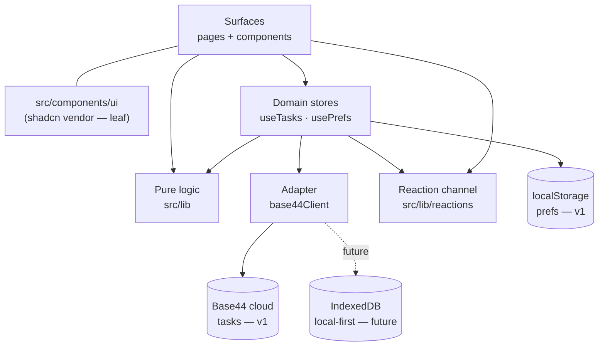
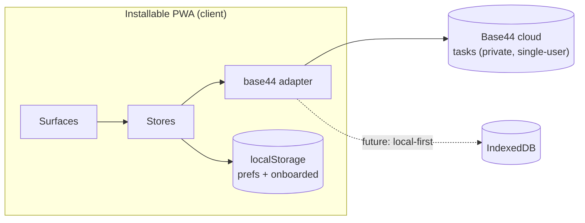
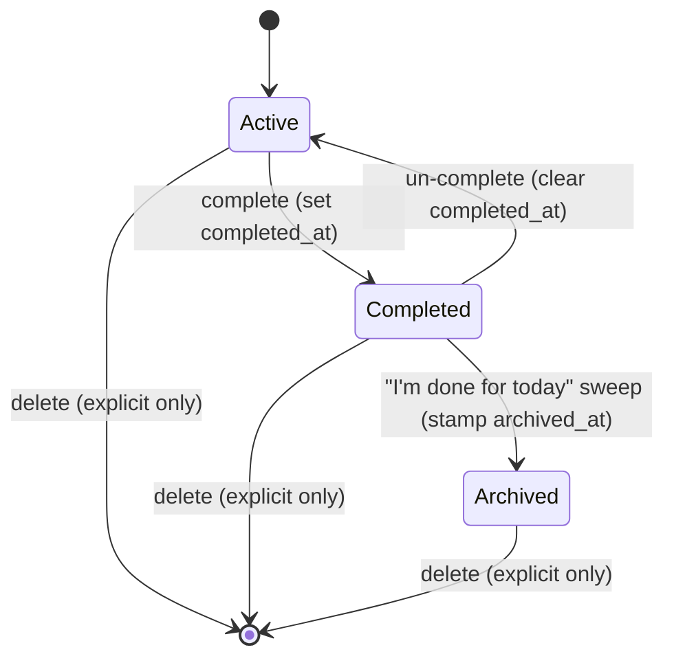

# Architecture Spine — Essence

> **Binding inheritance.** The PRD **restraint contract** (§5) is an ADOPTED gate over every decision below: no streaks/shame/absence-guilt/independence-takeover/execution-overwhelm/loud-cutesy/paywalled-core/feature-creep. Any rule that would enable one is a conflict to surface, not a local override. The DESIGN.md / EXPERIENCE.md spines win on visual/behavioral detail; this spine wins on structure.
>
> **Decision of record:** the delivery shell is an **installable PWA** (AD-1 / Structural Seed), which **supersedes** the UX spines' `[ASSUMPTION]` of a "WebView-wrapped native app." The UX docs should be updated to match.

## Design Paradigm

**Client-side React SPA with ports-and-adapters at the persistence boundary.** Four layers, with dependencies pointing one way (down):

- **Surfaces** (`src/pages`, `src/components`) — render and capture intent. Never touch a backend or storage directly.
- **Domain stores** (`src/hooks/useTasks`, `src/hooks/usePrefs`) — the *ports*. The single funnel for all reads/writes of a domain; own the cache, optimistic mutation, and rollback. The **only** code permitted to reach a persistence adapter.
- **Pure logic** (`src/lib`) — business rules (ordering, derivations, day-end) as pure, unit-tested functions. Depended on by stores and surfaces; depends on nothing above.
- **Adapter** (`src/api/base44Client`) — the *adapter*. The only module that imports the backend SDK. Swappable (Base44 today → IndexedDB local-first later) without touching any caller.

A separate **transient reaction event channel** (`src/lib/reactions`) carries companion-reaction signals — orthogonal to persistence: state is *derived*, reactions are *signaled*.

## Invariants & Rules



*Dependency direction is downward only. No module depends on a layer above it. Only the adapter imports the backend SDK. `usePrefs → localStorage` is **not** an AD-1 bypass: `localStorage` is the prefs store's own v1 adapter (AD-6), the local-first counterpart to Base44 behind the same port.*

### AD-1 — Persistence port [ADOPTED]
- **Binds:** all user-data reads/writes; NFR2, NFR10, NFR11
- **Prevents:** surfaces independently choosing where state lives (the shipped split-brain: tasks in Base44, win-count in `localStorage`) and a local-first migration touching every call site
- **Rule:** every surface/feature reads & writes user data **only** through a per-domain store module. Those modules are the **only** code that may import the backend client. The backend is an implementation detail *behind* the store; swapping it = rewriting a store's internals, never its callers.

### AD-2 — Single-funnel optimistic store [ADOPTED]
- **Binds:** all task mutations; NFR4, NFR6
- **Prevents:** divergent mutation/rollback handling and stale caches across surfaces
- **Rule:** one TanStack Query cache per domain (`["tasks"]`). Mutations are optimistic, computing the patch in **both** `onMutate` and `mutationFn` (no shared scope), rolling back to `ctx.previous` on error and invalidating on settle. Hook order is stable (no conditional hooks). Feedback fires before the save returns; never network-gated, never a blocking modal.

### AD-3 — Derived read-state, never duplicated [ADOPTED]
- **Binds:** progress wheel (FR16/FR25), carry-forward (FR21), today-count
- **Prevents:** a second source of truth drifting from the task list (the retired `winMoment` counter, and its midnight-rollover + double-count bugs)
- **Rule:** "today's progress" and "carry-forward" are **derived** from task state, never separately stored. `completed_at` is (re)stamped to *now* on every `false→true` transition and cleared on un-complete. Today-progress = count of tasks whose `completed_at` falls in the **local** day. Carry-forward = `due_date != null && incomplete && due_date < today` — a task with **no** `due_date` is never carry-forward. The `winMoment` localStorage counter is retired.
- **Carry-forward treatment (FR21):** the highlight is **identical regardless of how many tasks carry** — per-task weight never compounds and a mass of carried tasks must not read as an alarm field — and never intensifies with age. It carries a persistent **non-colour "still needs doing" label** on every surface (the meaning never depends on colour alone).
- **Wheel hierarchy (FR16):** the progress wheel is **subordinate in scale** to the one task — ambient proof, never a goal; on a completion the eye lands on the **win (the task)**, not the ring.

### AD-4 — Business rules are pure functions in src/lib [ADOPTED]
- **Binds:** ordering, carry-forward, today-progress, day-end sweep eligibility, subtask-reveal selection; NFR12
- **Prevents:** two surfaces computing the same rule differently; untested core logic
- **Rule:** core logic lives as pure functions in `src/lib`, unit-tested with Vitest (the **only** safety net there — ESLint/typecheck exclude `src/lib`). Stores and components call them; never re-implement inline.

### AD-5 — Task schema invariants
- **Binds:** FR5, FR9, FR12, FR15, FR22; the Base44 `Task` entity
- **Prevents:** ranking/ordering/lifecycle state having no agreed home, and the shipped schema drift
- **Rule:** the `Task` entity carries `priority` (integer 1–5), `order` (persisted manual-rearrange key), `completed_at` (timestamp; set on `false→true`, cleared on un-complete), `archived_at` (nullable timestamp). `due_date` stays **date-only** `YYYY-MM-DD`. **Reconcile the drift:** the code's undeclared `due_time` and `today` are dropped; `priority:"normal"` becomes the integer. Every schema change is **round-trip-verified via a real read** before wiring (the "Nidus" silent-sync failure, NFR12).

### AD-6 — Personalization is local [ADOPTED]
- **Binds:** FR1, FR3, NFR8, NFR9, NFR10
- **Prevents:** prefs scattered between the Base44 `User` entity, component state, and `localStorage`
- **Rule:** onboarding/personalization prefs (name-to-be-called, colour scheme, creature, and the `onboarded` flag) live **local** (`localStorage`) behind a `usePrefs` store — the local-first side of the port boundary in v1. Never written to Base44. Trade-off accepted: no cross-device pref sync in v1.

### AD-7 — Archive lifecycle: stamp, never delete
- **Binds:** FR19, FR22, FR23, FR26
- **Prevents:** surfaces disagreeing on what "archived" means; the deletion of completed history (today's `clearCompleted` deletes); two candidate Archive sort keys
- **Rule:** a single `archived_at` stamp encodes the lifecycle. **`completed && !archived_at` = "completed-unswept"** — shown dimmed on Focus *regardless of which day it was completed* (it is **not** a "today" marker); `archived_at` set = in Archive. "I'm done for today" is a store action that **bulk-stamps** the currently-completed tasks — it **never deletes**. "Ended day" is an *action*, not persisted state. Archiving is triggered **only** by that explicit gesture — **never** by age, midnight, or empty-list. The Archive orders **by `archived_at` descending** (the single sort key; `completed_at` is *not* an Archive key). Accepted consequence: never-swept completed tasks accumulate as dimmed across days — and a task completed yesterday but unswept shows dimmed today yet is *not* in today's progress count (AD-3): two **consistent** facts (completed-unswept ≠ completed-today), not a contradiction.

### AD-8 — Focus exposure boundary [ADOPTED]
- **Binds:** FR11, FR13; restraint contract §5
- **Prevents:** any surface leaking the full backlog into the "doing" view
- **Rule:** the **Focus** surface renders exactly one task — the first incomplete in **effective order** — with ≤2 subtasks revealed. The full backlog exists **only** on the **Plan** surface. **Effective order** is the persisted `order` field; it is **seeded** from the `src/lib` default ranking (priority 5→1, then `due_date` sooner-first with **null `due_date` sorting last within a priority band**, then created earliest-first — a *total* comparator, never intransitive) and is **authoritative once the user manually rearranges** (a manually-placed task holds its slot **globally**, regardless of priority — "override" means global, not tiebreak-only). Both Focus and Plan read the same effective order. Priority is hidden in Focus.

### AD-9 — Reaction channel: signals, not state
- **Binds:** FR14, FR15, FR17 (the three-tier ladder), FR20
- **Prevents:** the companion coupling to the surface tree, re-deriving event-type from a count diff, a tunable variable-reward loop, and a celebration stranded by a rolled-back save
- **Rule:** companion reactions travel a **transient, tier-tagged module emitter** (`reactions.js`): the task store emits `{tier: 'subtask' | 'task' | 'dayend'}` at the transition; `Companion` subscribes and plays the matching tier. The channel carries **transient events only** — never persisted, never a source of truth. The tier is set by **event type only** and stays flat within a tier (no intensify by priority/volume/milestone). A **no-subtask task** completing fires the **task** tier (a whole-task win), not the subtask tier.
- **Line selection** within a tier is **random/rotating** — never chosen by completion count, sequence position, or "how the day is going" (closes the variable-reward loophole; no "earned" or escalating line).
- **Rollback policy:** a reaction is fire-and-forget on the *optimistic* transition (NFR4) and is **not** revoked if the save later rolls back — the ~1.5s self-dismissing micro-reaction has already faded, and the failure path shows the honest rolled-back **state** + a toast (NFR6). The **day-end sweep** (tier 3) is the one bulk case: on save failure the swept tasks reappear with the toast; the sigh having played is accepted, never re-fired.

### AD-10 — Theming & creature recolor via tokens, one art set
- **Binds:** NFR5, NFR8; the 7 colour schemes; DESIGN.md
- **Prevents:** divergent recolor approaches and per-scheme asset sprawl; a second chromatic accent
- **Rule:** all 7 schemes re-skin the **same** component primitives via CSS custom properties swapped by a root-level data-attribute; only token *values* change. Single-accent + semantic-success-only is a token invariant; **no hardcoded hex**. The creature recolors via a **per-scheme token-driven transform over one shared art set** — never per-scheme baked art (per-scheme exports are a fallback only if the transform can't hit a scheme's `creature-tint`). The art is a 470-fill, full-luminance-range painterly SVG (no gradients), so the robust transform is an **SVG `feColorMatrix`** (desaturate → tint toward `creature-tint`), **not** a CSS `hue-rotate` chain (which clips and won't preserve luminance); this **requires the SVG be inlined** in the component (a document `filter:url(#…)` cannot reach an ``-loaded SVG). Silhouette + reaction glow stay ≥3:1 against their background in every scheme; the glow is **never** the sole reaction signal (the companion copy line always carries it).
- **Accent text-contrast rule:** the accent is a **fill / large-text (≥18.66px or ≥14px bold) / UI-component colour only (≥3:1)** — **never** body-size text or links in running copy (it is sub-AA at body size). Small interactive text/links use `highlight` on dark schemes, or a darkened `accent-text` (≥4.5:1) on light schemes.

### AD-11 — Reduced-motion & no-alarm, cross-cutting [ADOPTED]
- **Binds:** NFR3, NFR5, FR20, FR24; all animated/stateful components
- **Prevents:** a completion/win hidden behind motion that reduced-motion drops; informational content silently lost when motion is off; alarm colour entering the loop; completion conveyed by colour alone
- **Rule:** every animation gates on `useReducedMotion()` and **always resolves to its end-state** (state shown, motion dropped, **never a frozen mid-frame**). Ambient/idle loops and intro beats (e.g. the FR24 first-open beat) resolve to a **static resting pose**, and any information an animation carried must still be **presented statically — never silently dropped**. No red/alarm colour anywhere in the task loop.
- **Completion is never colour alone:** the done state **requires** the white check glyph **and** the line strike-through as non-colour signals; success-green is reinforcement, never sufficient on its own.
- **Progress wheel a11y:** `role="img"` with a number-free `aria-label`, `aria-live="polite"` — **never** `role="progressbar"` (its `aria-valuemax` would leak a denominator and violate FR25); the shipped `RING_TARGET=8` constant is **deleted**, not re-skinned.

### AD-12 — Notifications off by construction
- **Binds:** NFR7; restraint contract rules 2 & 3; the PWA service worker (AD-1's delivery shell)
- **Prevents:** the installable-PWA service worker quietly opening a push/re-engagement surface that the contract forbids
- **Rule:** v1 ships **no push notifications**. The service worker is for **installability + bundle caching only** — it **never** registers for Push or Notification permissions. If push is ever offered, it is an opt-in **Settings** toggle that **always starts off** and is only ever enabled by the user; even then the content is bound by the contract — **never** shame, "you missed," decay, or "you've been gone" / return-nag copy. Time away from the app carries **no penalty, decay, or guilt** anywhere.

## Consistency Conventions

| Concern | Convention |
| --- | --- |
| File naming | components `PascalCase.jsx` · hooks `useX.js` · lib `camelCase.js` · pages `PascalCase.jsx`. Imports via the `@/` alias. JS/JSX only (no `.ts`/`.tsx`); types via JSDoc. |
| Dates | date-only `YYYY-MM-DD` strings for `due_date` (matches Base44, no UTC drift). `completed_at`/`archived_at` are full timestamps (metadata, exempt from date-only). |
| Base44 fields vs engine JSON | Base44 fields are `snake_case` (`due_date`, `completed_at`); the `recurrence` JSON is opaquely `camelCase`, engine-owned, built only via `createRecurrenceRule()`. |
| State & mutation | all task I/O via `useTasks`; all prefs via `usePrefs`; optimistic + rollback (AD-2). No component calls `base44.entities.*` directly. |
| Events | reaction events are transient, tier-tagged (`subtask`/`task`/`dayend`), via the `reactions` emitter — never persisted (AD-9). |
| Styling | design tokens / CSS variables only; **no hardcoded hex**. `src/components/ui/**` is shadcn vendor — never hand-edited. |
| Lint scope gap | ESLint lints only `src/components/**`, `src/pages/**`, `Layout.jsx`; typecheck excludes `src/lib`, `src/api`, `src/components/ui`. Engine correctness is caught by **Vitest only** — `src/lib` modules ship with tests. |

## Stack

_Seed — verified current in `project-context.md` (2026-06-23); the code owns this once it exists._

| Name | Version |
| --- | --- |
| React | 18.2 |
| React Router | 6.26 |
| Vite (+ `@vitejs/plugin-react`, `@base44/vite-plugin`) | 6.1 |
| TanStack Query | 5.84 |
| Tailwind (+ `tailwind-merge`, `clsx`, `cva`) | 3.4.17 |
| shadcn "new-york" (Radix) · lucide-react | — · 0.475 |
| framer-motion | 11.16 |
| date-fns | 3.6 |
| `@base44/sdk` · `@base44/vite-plugin` | ^0.8.34 · 1.0.23 |
| `vaul` (drawers) | 1.1 |
| TypeScript (`checkJs` only — no TS source) | 5.8 |
| Vitest · ESLint (flat) | 4.1 · 9.19 |

> `package-lock.json` is the source of truth for exact pins; the above are seed snapshots. NFR1: the ~17-dependency runtime set is deliberate — no new runtime dependency without strong justification. The PWA shell is the only new surface area v1 adds; use **`vite-plugin-pwa`** (current on Vite 6) configured for **install + auto-update**, **not** runtime-caching the Base44 API (avoid stale data — see Operational Envelope).

## Structural Seed

**Persistence containers (v1):**



**Task lifecycle:**



**Source tree (scaffold, not a mirror):**

```text
src/
  pages/            # 4 surfaces: Focus (/) · Plan · Archive · Settings; + auth + Onboarding
  components/
    companion/      # Companion — subscribes to the reaction channel
    tasks/          # Focus card, two-at-a-time subtask reveal, progress wheel
    layout/         # AppLayout, BottomNav (+FAB center → Plan quick-input)
    ui/             # shadcn vendor — do not hand-edit
  hooks/
    useTasks.js     # task store: query cache + optimistic mutations + archive sweep action
    usePrefs.js     # NEW — local prefs store (name, scheme, creature, onboarded)
  lib/
    ordering.js     # NEW — pure task-ordering (tested)
    dayEnd.js       # NEW — sweep eligibility · carry-forward · today-progress derivations (tested)
    reactions.js    # NEW — transient tier-tagged reaction event channel
    recurrence.js   # DORMANT — out of v1 scope (built + tested, unwired)
    # winMoment.js  — RETIRED (AD-3)
  api/
    base44Client.js # the ONLY backend-facing module (the adapter)
base44/
  entities/Task.jsonc   # + priority, order, completed_at, archived_at ; − due_time, today
```

**Operational envelope:**

| Concern | v1 posture |
| --- | --- |
| Deploy target | Base44 app platform (build emitted by `@base44/vite-plugin`); app id in `base44/.app.jsonc`. |
| Environments / config | `VITE_BASE44_APP_ID`, `VITE_BASE44_APP_BASE_URL` via `.env.local` (gitignored), also overridable by URL query (`?app_id=&app_base_url=`). No secrets in client (Base44 token is per-session auth). |
| Build / test | `vite build`; `npm test` / `vitest run` (resolved via `vite.config.js`, no dedicated config). `src/lib` is the only Vitest-guarded layer and the only safety net for engine logic. |
| Quality gate | ESLint flat + `checkJs` typecheck — **scope-limited** (exclude `src/lib`, `src/api`, `src/components/ui`); engine correctness rides on Vitest. No CI is defined yet — **open item** (a pre-merge `lint + vitest + build` gate is the obvious first one). |
| Delivery | installable PWA: web manifest + service worker for **install + auto-update only**; full offline deferred. Never registers push (AD-12). |
| Data backup/export | none in v1; portability/export is the named future monetization surface (restraint contract rule 7) — not built here. |

## Capability → Architecture Map

| Capability / Area | Lives in | Governed by |
| --- | --- | --- |
| Onboarding & prefs (FR1–3, FR24, NFR8/9) | `pages/Onboarding`, `usePrefs` | AD-1, AD-6, AD-10 |
| Capture & planning (FR4–10) | `pages/Plan`, `useTasks`, `lib/ordering` | AD-2, AD-4, AD-5, AD-8 |
| Focus / doing (FR11–16) | `pages/Focus`, `components/tasks`, `lib/ordering` | AD-3, AD-8, AD-9, AD-11 |
| Companion reactions (FR17–20) | `components/companion`, `lib/reactions` | AD-9, AD-11 |
| Carry-forward (FR21) | `lib/dayEnd` (derived) | AD-3, AD-11 |
| Archive & day-end (FR19, FR22–23, FR26) | `pages/Archive`, `useTasks` sweep, `lib/dayEnd` | AD-7 |
| Progress wheel (FR16, FR25) | `components/tasks` (derived) | AD-3, AD-11 |
| Persistence / data ownership (NFR2, NFR10–11) | `api/base44Client`, the store layer | AD-1 |
| Notifications / re-engagement (NFR7) | service worker, `pages/Settings` | AD-12 |
| Theming & 7 schemes (NFR5, NFR8) | token layer, `usePrefs`, `components/companion` | AD-6, AD-10 |

## Deferred

- **Local-first storage (NFR11).** The port (AD-1) keeps it cheap; the IndexedDB adapter itself is post-v1. Revisit when cross-device/offline becomes a real need.
- **Cross-device pref sync.** Out by AD-6's trade-off; revisit only if multi-device pref-follow is wanted (would add an opt-in cloud mirror behind `usePrefs`).
- **Full offline PWA.** v1 is Base44-online; the service worker is for installability only. Offline task editing waits on the local-first adapter.
- **Recurrence engine.** Built + tested in `lib/recurrence.js`, stays unwired (PRD §3). Wiring (and its calendar/RRULE implications) is post-v1.
- **Google Calendar sync.** Shipped, kept **dormant** — gated off by `CALENDAR_CONNECTED_KEY` default-false, no v1 UI. Not removed (avoids churn), not surfaced.
- **Category UI.** `Task.category` kept (no migration) but unsurfaced; v1 is pure-priority. Tints remain available if revived.
- **Manual-`order` representation** (float gap-key vs integer reindex) — owned by `lib/ordering` + the store at build time.
- **Never-swept accumulation (AD-7).** Deliberate; revisit *only* if it feels cluttered in real use — never by adding auto-archive (would break manual-only).
